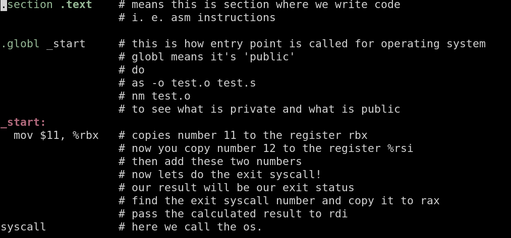
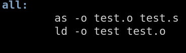

Hi everyone, Today we are going to write some short and simple assembly code, which only adds two numbers and exits passing as exit status the result of the addition.



so you need to
* connect to server
* clone this repo
* cd to it (should i say this?)
* type what  you see on the image (without comments) with your own hands

by using your preferred editor, the server has vim and nano.

if you don't know vim, that's not good for you.

* write a makefile which has following content:



all - is a section. first section is executed when you type `make`

if you want to execute other section, you type `make sectionname` where sectionname is the name of your section.

Important: commands to be executed need to start with TAB character, not whitespaces.

* ok so you now have the source code, the makefile. build by typing `make`
* if it doesnt build, change the source code and try again
* if it builds, try to run it. how to run from current dir on unix?
* ok if it didnt crash, how do you see the result?

you need to do

```
echo $?
```

remember `echo $PATH` ? you always have your exit status as `$?` variable.
and that's where your `return something` in c's main function go.

ok you did it?
you see correct result?
commit files, but NEVER COMMIT BINARIES
push.

now try other thing:

add 200 + 100

and now see the result.

the register is 64bit, so the number fits.
why you see the number you see?

take care.


you're  done, thank you, till the next time.

